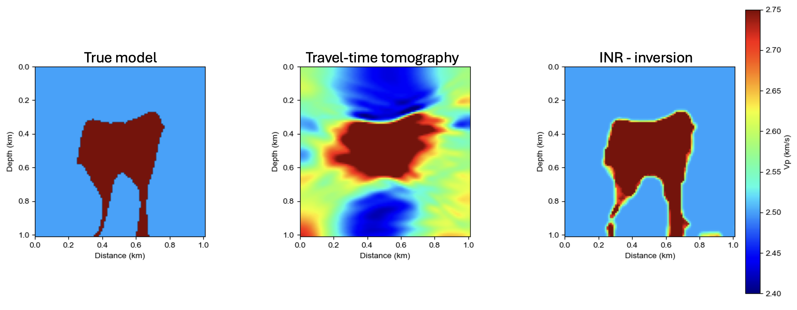

# Implicit Neural Representation Applied to Cross-Well Tomography

Scripts developed for the **Seismic Imaging** course taught by Professor Nicola Bienati at the University of Pisa, within the [MSc. In Exploration and Applied Geophysics](https://www.dst.unipi.it/home-wgf.html).

---

## Overview

This didactic exercise addresses the cross-well tomography problem using an **Implicit Neural Representation (INR)** framework.  

The goal is to introduce students to modern function-parameterization strategies for inverse problems, combining classical straight-ray tomography with neural field modeling techniques.

The material was developed by **Oumaima Badraoui** under the supervision of [Felipe Rincón](www.linkedin.com/in/felipe-rincond) at the University of Pisa, Italy.
---

## Contact

For questions or feedback, please contact:  
**o.badraoui@studenti.unipi.it**

---

Italy, 11 March 2026

---

## Acknowledgments

Parts of the theoretical background and implementation philosophy were inspired by publicly available lecture notes from ETH Zurich, particularly the materials on inverse theory and straight-ray tomography:

https://swp_ethz.gitlab.io/public/lecture_notes_inverse_theory/notebooks/Straight-Ray_Tomography.html

These resources are gratefully acknowledged as valuable educational references.
